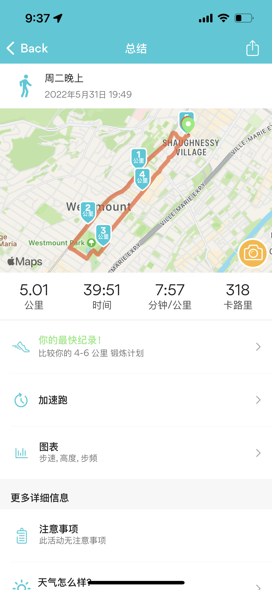

Basically didn't sleep the whole last night. Finally fell asleep at around 8:00 am in the morning and woke up at 12:00 pm. Before going to sleep, I replied to messages from colleagues and updated my status on teams saying that I might not be available in the morning. I genuinely feel grateful and lucky that I can flexibly arrange my working hours when I need to. But usually I try to stick to the 9-to-5 or 10-to-6 schedule.

Overall, I've had a very good day:

- Greatly improved the implementation for my current task, and improved the instrumented tests code as well. And I really enjoy the process of doing implementation, receiving feedbacks, and improving code to make it cleaner and more maintainable.
- Played Ping Pong for a little while with colleagues.
- Jogged around 5 km in the evening.
  
