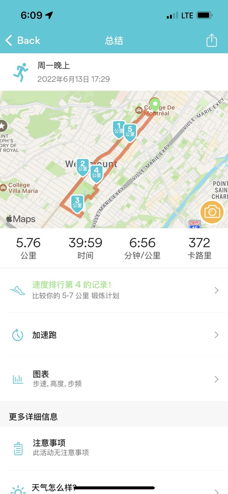

## 工作

今天几乎没啥工作，上班的时候，又重新看了一点 Core Java 第一卷的一些知识；办公室同事不多，打乒乓球也找不到人。

## 跑步

原本打算星期天的时候跑步，但前几天跑完步，膝盖和脚都有点不舒服，所以整个周末都没跑。今天跑的时候，就正常慢跑，也因为跑得慢一点，反而中间休息的次数少一些，到最后跑完，速度也还行，没有比前些天慢太多。其实晨跑是最好的，因为傍晚跑，空气中有很小的小虫子，影响体验。看后面能不能争取早上爬起来跑。

