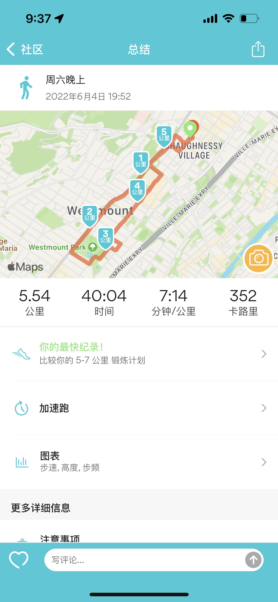

今天天气很好，阳光明媚，但风很大。不管夏天冬天，我都不喜欢风大，吹得头发乱。

中午吃了东西，就坐地铁去了 Chinatown 剪头发。预约的人比较多，但因为我没有提前预约，就等了很久。19 年来这里剪过一次之后，就再也没有换过地方；有一次来剪头发，理发店不营业，去了附近的另外一家，虽然便宜一些，但理发师水准远不及这边。这边的理发师，都是早年过来的移民，大概是从广东过来的，粤语、普通话、英语和法语都讲；因为剪了很多年的缘故，水平就很稳。

傍晚炖好牛腩，就出门慢跑，跑了 5 千米左右。这两天跑步感觉比以前轻松了一点。

晚上帮妹妹问了一下以前的同事（朋友）是否招免费实习生，希望事情能成吧！Ok, let's call it a day. 洗洗碎啦！  

