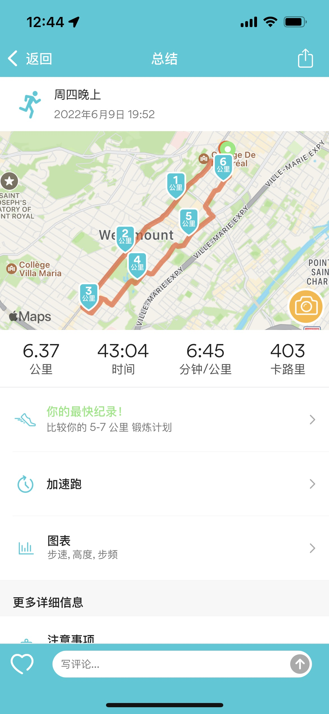

早上 7 点就有一个会议，不得不设闹钟爬起来听，当然听的效果也很差，好在也不需要我们怎么发言。因为是强迫自己醒过来，状态就很不好，会议结束后直接在床上又睡到了九点多，醒来大脑昏昏沉沉。

最近的工作主要是做文档。其实我个人并不排斥写文档这件事，但是写东西的前提是你真的懂你写的东西，知道自己在写什么，写起来也容易。但让我去写项目模块的文档，就只能说是强人所难。我也不管那么多，自己弄了一下，然后就直接问相关的负责人，到底还需要做哪些调整和补充；也问了关于 unit testing 的部分。希望后面不会有太多要弄的吧。明天跟另一个经理约了会议，讨论他那边有没有我能帮忙做的事情。虽然我也想工作轻松，但确实做得多才能学得多，有机会就多做点吧。一方面，自己对手上现在的项目，本来也兴趣不多。

下班后慢跑了 6 千米，第一次跑 6 千米，也还行。最近体重，应该是比较稳定地下降了一公斤左右，体重变化不大，但能明显感觉小肚子还是小了一点。继续努力！Good night.

