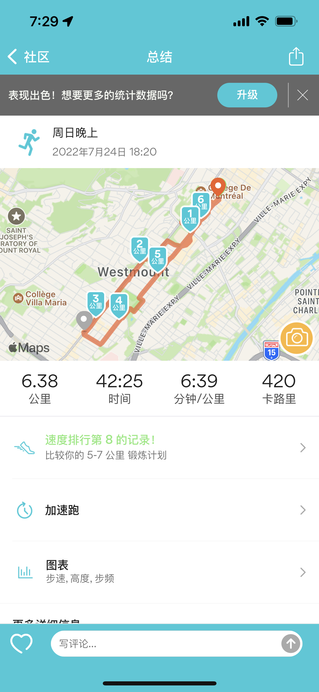
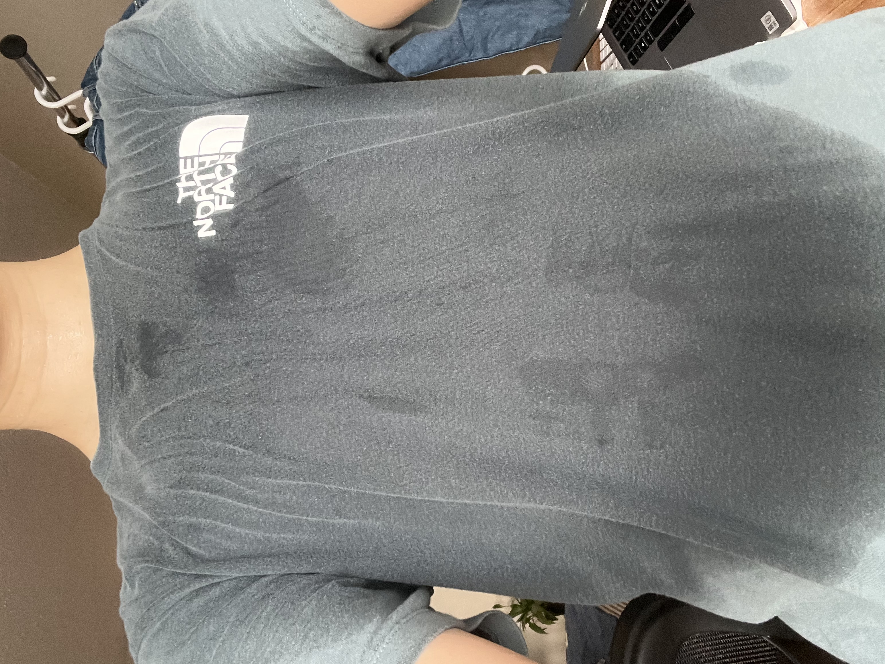

# 星期天

一晃居然一个月左右没有更新任何日记了。过去一个月，以及接下来的一段时间，工作都会相对忙碌一点。比较开心的是，有在坚持跑步，也有稍微控制一丁点饮食，所以体重从两个月前的 63 公斤左右降到了最近的 60 公斤左右。Jogging does make me feel better about myself. It helps improve my immunity and relieves some of my minor health issues. The other day I was thinking that running/jogging is in a sense an antidote to midlife crisis.

I received a full-week training this week, which was really intensive and tiring, partly because the training run from 7:00 am to around 3:00 pm and I couldn't get enough sleep. Another reason was that I had covid again. This is absolutely frustrating, and I decided tonight that I am going to be super careful from now on.

I went outside to jog today, which is my second jog this week. I hope that someday I can get up very early in the morning and develop the habit of jogging in the morning instead of in the evening. In this way, I will have more time in the day and have better life habits.

