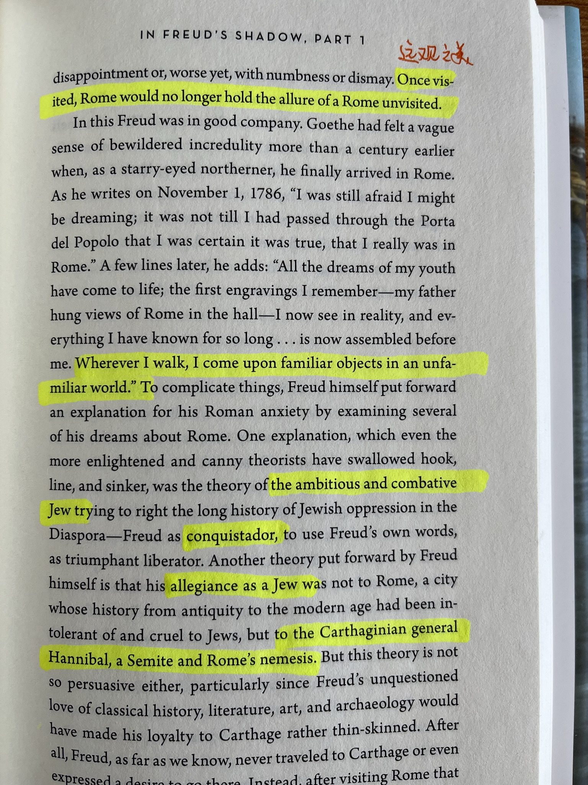

1. 我们对一个地方的感情，其实是通过发生的故事和记忆，建立起来的。曾经看过很多以北京为背景的故事，并因此向往去到北京；而当我真的在北京工作生活过两年之后，却并没有喜欢上那个忙碌、拥挤、色调沉闷的城市。过了这么多年，我最爱的城市依然是成都。

2. Johann Wolfgang von Goethe 约翰·沃尔夫冈·冯·歌德

3. 每次读 Andre Aciman，都会被他文字的美所折服。他的写作非常“dense”，也像水一样非常流畅，偶尔会有繁复之感。一定程度上，读他的散文，会让我联想到 Alain De Botton。
