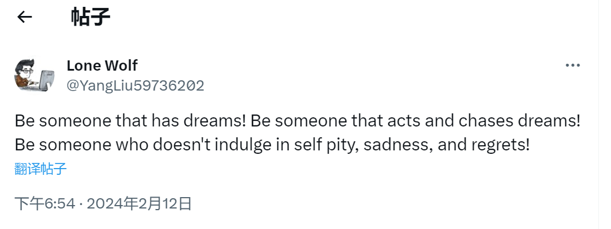

## Lundi, 2024/02/12
I should quit. I mean, not quitting my job, but quitting liking someone.  

## Jeudi, 2024/01/11
今天也是，情绪莫名不是很对。  
中午跟同事结束法语练习之后，在cafeteria看到了他跟另外一个同事。隔着一点距离，and he looks great.  
After coming home, I just wanted to listen to music which is loud, maybe noisy, but can help one release emotions.  
I picked up a novel by Virginia Woolf, but I have to admit that it's a difficult read.  
One good thing, however, is that I feel my overall health is getting a little bit better. Still need to eat more vegetables.  

## Mardi, 2024/01/09

今天情绪感觉有点低落。下班后躺在床上，听“安河桥”的时候给听哭了。音乐确实是很神奇，小时候常常看电视看哭，长大后已经很难看电视剧看哭，但最近几年，常常在听音乐的时候听哭，就好像音乐突然唤起了内心深处的一些情绪。  
下午的时候查了下，我养了两三年的植物，名字原来叫 Peace Lily。

## Mercredi, 2024/01/03

- 法语学习方面，可以找一个对话型的 podcast，用来积累口语；然后再找一个新闻型的 programme，用来积累词汇和短语。
  - Easy French
  - InnerFrench
- By the end of the day, think what you have done today to make yourself happy or healthy.
  - made and had corn juice
  - played Ping Pong with colleague

## Dimanche, 2023/11/05

- [ ] 购买新的日记本、垃圾袋和拖鞋
- [ ] 继续思考 self reinvention
- [ ] 整理房间

## Samedi, 2023/11/04

早上起来嘴唇就已经肿得不行了，并有了新的疱疹。过去的三四年，身体素质和免疫力一直在不停往下降，随之而来非常多的慢性疾病。其中很重要的一个原因是多次感染新冠。如今，真的到了不得不改变自己生活方式，努力提升免疫力的时候了。这几天就在想一个词：self reinvention。为什么有人能做到早起，而我一直做不到？为什么有人能去健身房锻炼，而我做不到？

重新塑造自己，一方面我觉得需要付诸于行动；另一方面在于要舍得去投资自己，努力去建立一个良性的循环：锻炼提升免疫力 -> 身体更健康，少受慢性疾病的困扰 -> 更有强的精力 -> 做更多的事情 -> 改善情绪，改善意志力。

## Dimanche, 2023/10/29

感觉冬天真正地来了，气温从周六的十多度一下降到了几度。  
下午看了 WTT 法兰克福的比赛，樊振东对副冠军。Truls 打得还是可以的，小胖失误偏多了一点，但总体实力无疑还是小胖更强一些，最后也没啥悬念地 3:1 拿下了比赛。最近一年 Truls 成熟了很多，基本上没有了以前输球或者不高兴就摔拍的举动了，这样我对他的印象也逐渐好起来。  
周五的时候去拿了 7 服中药，感觉还是很有效的，身体炎症马上就消了很多。但睡眠还是有很大问题，慢慢来吧，这次准备吃药的时间久一点，希望能把身体调整到更好的状态。  
下午五点左右去了康大的图书馆，也没想真去学点什么或者看看什么书，更多是想出门去走走，不想老是待在家。一直呆到了晚上八九点，回家的时候，心情变得好一些。  
回家后看了一点点 The End of the Affair，确实写得挺好的，让人感觉作者很有自己的风格：  

## Monday, 2023/08/14

### Planning

1. Morning jog: 5km
2. Buy head band & socks at Decathlon

## Sunday, 2023/08/13

今天天气很好。回到 Montreal 之后，生活又开始变得简单。思考“到底想过什么样的生活”这个问题，已经有一段时间。那理想中的生活，到底是什么样子的？

1. 坚持运动：晨跑。去年夏天是真正地做到了每周都 2-3 次跑步，每次 5-6 公里；今年也有跑，但频率不如去年。另外，一直都是晚饭前跑。晨跑的好处在于，一个是要早起，二是不占用晚上的时间。
2. 每月存钱
3. 学法语
4. 看书

## Sunday, 2023/06/18

有的时候确实是欲望太多，想要的东西太多，而自律又不够。一直幻想理想的生活环境和生活方式，但又一直妥协，生活在自己并不满意的环境和状态里。等 8 月回加拿大之后，改变生活的环境和整个人的状态吧。钱也可以慢慢存，不一定非要牺牲生活的质量。

## Friday, 2023/06/16

还有十天就要回国了，但还没开始准备回国要买和要带的东西。这个周末可以好好计划一下。  
下班后，走路去 Apple Store 看了最新出的 MacBook Air 15，屏幕确实是比较大，但看着也并没有很心动的感觉，哈哈。  
到晚上的时候，身体又很不舒服，也不知道什么时候能恢复到 2019 年的健康状态。
